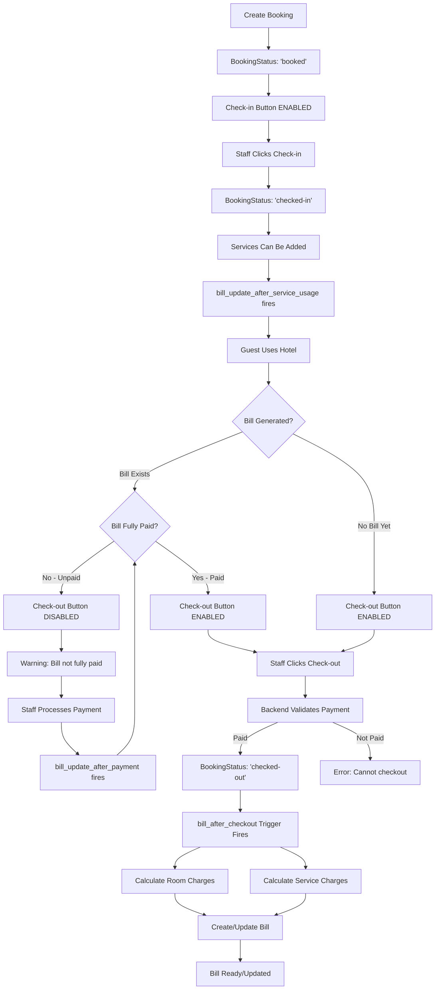

# Bill Automation Implementation

## Overview
This document describes the automated billing system implemented using database triggers to calculate and update bills automatically during the booking lifecycle.

## Features Implemented

### 1. **Frontend: Booking Operations UI** (`BookingOperations.jsx`)

#### Always-Visible Check-in/Check-out Buttons
- **Both buttons are now always visible** for active bookings
- Button states change based on `BookingStatus` **and Bill Payment Status**:
  - **`booked` status**: 
    - ✅ Check-in button: **ENABLED** (green)
    - ❌ Check-out button: **DISABLED** (gray)
    - Cancel booking button shown
  - **`checked-in` status**: 
    - ❌ Check-in button: **DISABLED** (gray)
    - ✅ Check-out button: **ENABLED** (blue) - **ONLY IF BILL IS FULLY PAID**
    - ⚠️ Check-out button: **DISABLED** (gray) - **IF BILL NOT FULLY PAID**
    - ⚠️ Warning message shown: "Bill not fully paid: $XX.XX remaining"
  - **`checked-out` status**: 
    - Both buttons **DISABLED** (gray)
    - Shows "Completed" status
  - **`cancelled` status**: 
    - Shows "Cancelled" status only

#### Payment Status Validation
- **Backend validation**: Prevents checkout if bill exists but not fully paid
- **Frontend visual indicators**:
  - 🟠 Orange warning message displays remaining amount
  - 🔒 Checkout button disabled and grayed out
  - 💡 Tooltip on hover shows payment requirement
- **Real-time updates**: Payment status updates when bookings are refreshed

#### Visual Feedback
- Enabled buttons have bright colors (green/blue) with hover effects
- Disabled buttons are grayed out with reduced opacity
- Loading spinner shows during processing
- Toast notifications for success/error messages
- Alert icon with payment warning for unpaid bills

### 2. **Database Triggers** (`audit_triggers.sql`)

#### A. `bill_after_checkout` Trigger
**Purpose**: Automatically create/update bill when guest checks out

**Trigger Type**: `AFTER UPDATE` on `booking` table

**Activation**: When `BookingStatus` changes to `'checked-out'`

**Calculations**:
```sql
-- Calculate stay duration
v_days = DATEDIFF(CheckOutDate, CheckInDate)

-- Calculate room charges
v_room_charges = SUM(roomType.DailyRate × v_days) for all booked rooms

-- Calculate service charges
v_service_charges = SUM(Quantity × PriceAtUsage) for all services used

-- Calculate total
v_total_amount = v_room_charges + v_service_charges
```

**Actions**:
- Checks if bill already exists for the booking
- If exists: **Updates** existing bill
- If not exists: **Creates** new bill
- Sets `BillStatus` to `'pending'`
- Initializes `Discount` and `Tax` to `0.00`

#### B. `bill_update_after_service_usage` Trigger
**Purpose**: Update bill when new services are added during guest stay

**Trigger Type**: `AFTER INSERT` on `serviceUsage` table

**Activation**: When a new service usage record is added

**Actions**:
- Checks if bill exists for the booking
- Recalculates total service charges
- Updates `ServiceCharges` and `TotalAmount` in bill
- Formula: `TotalAmount = RoomCharges + ServiceCharges - Discount + Tax`

#### C. `bill_update_after_payment` Trigger
**Purpose**: Update bill status based on payment received

**Trigger Type**: `AFTER INSERT` on `payment` table

**Activation**: When a payment is recorded

**Actions**:
- Calculates total paid amount (sum of all completed payments)
- Compares with total bill amount
- Updates `BillStatus`:
  - `'paid'` if total_paid >= total_amount
  - `'partial'` if total_paid < total_amount

### 3. **Workflow**

#### Complete Booking Lifecycle with Automated Billing and Payment Validation



#### Step-by-Step Process with Payment Validation

1. **Booking Creation** (`BookingStatus: 'booked'`)
   - Guest information recorded
   - Rooms assigned
   - Check-in/Check-out dates set

2. **Check-in** (Frontend button click → `BookingStatus: 'checked-in'`)
   - Check-in button becomes disabled
   - Check-out button becomes enabled (conditionally)
   - Room status updated to 'occupied'

3. **During Stay**
   - Staff can add services (spa, restaurant, etc.)
   - Each service addition triggers `bill_update_after_service_usage`
   - Bill updated automatically if it exists
   - Bill created manually or automatically

4. **Pre-Checkout Validation** (NEW)
   - **Frontend checks**:
     - If bill exists and `BillStatus` != 'paid'
     - Calculates remaining amount
     - Disables checkout button
     - Shows warning: "Bill not fully paid: $XX.XX remaining"
   - **Staff must process payment** before checkout allowed
   - Payment recorded → `bill_update_after_payment` fires
   - Bill status updates → Checkout button becomes enabled

5. **Check-out** (Frontend button click → `BookingStatus: 'checked-out'`)
   - **Backend validation occurs first**:
     - ✅ Checks if bill exists
     - ✅ Calculates total paid vs total amount
     - ❌ Rejects checkout if unpaid: "Cannot check-out: Bill not fully paid. Remaining amount: $XX.XX"
     - ✅ Allows checkout if fully paid
   - **Trigger `bill_after_checkout` fires automatically**
   - Calculates:
     - Days stayed: `DATEDIFF(CheckOutDate, CheckInDate)`
     - Room charges: `Daily Rate × Days × Number of Rooms`
     - Service charges: Sum of all service usage
   - Creates or updates bill record
   - Both buttons become disabled
   - "Completed" status shown

6. **Payment Processing**
   - Staff processes payment(s)
   - **Trigger `bill_update_after_payment` fires**
   - Bill status updated based on amount paid

## Database Schema Changes

No schema changes required! The triggers work with existing tables:
- `booking` (reads CheckInDate, CheckOutDate, BookingStatus)
- `bookingRooms` (links booking to rooms)
- `room` (links to roomType)
- `roomType` (provides DailyRate)
- `serviceUsage` (provides service charges)
- `bill` (updated by triggers)
- `payment` (triggers bill status updates)

## Bill Table Fields Updated by Triggers

| Field | Updated By | Calculation |
|-------|------------|-------------|
| `RoomCharges` | `bill_after_checkout` | `SUM(DailyRate × Days)` for all rooms |
| `ServiceCharges` | `bill_after_checkout`, `bill_update_after_service_usage` | `SUM(Quantity × PriceAtUsage)` |
| `Discount` | Manual (staff) | Initially 0.00 |
| `Tax` | Manual (staff) | Initially 0.00 |
| `TotalAmount` | All triggers | `RoomCharges + ServiceCharges - Discount + Tax` |
| `BillStatus` | `bill_after_checkout`, `bill_update_after_payment` | 'pending', 'partial', or 'paid' |

## Manual Adjustments

Staff can still manually:
- Adjust `Discount` field
- Adjust `Tax` field
- These are not automatically calculated to allow flexibility

After manual adjustments, you may want to recalculate `TotalAmount`:
```sql
UPDATE bill 
SET TotalAmount = RoomCharges + ServiceCharges - Discount + Tax 
WHERE BillID = ?;
```

## Testing the Implementation

### 1. Test Check-in/Check-out UI with Payment Validation
```
1. Open Booking Operations page
2. Find a booking with status 'booked'
3. Verify Check-in button is GREEN and enabled
4. Verify Check-out button is GRAY and disabled
5. Click Check-in
6. Verify Check-in button becomes GRAY and disabled
7. Add some services to the booking (to create a bill)
8. Refresh the booking list
9. Verify Check-out button is GRAY and disabled
10. Verify orange warning message: "Bill not fully paid: $XX.XX remaining"
11. Process full payment for the bill
12. Refresh the booking list
13. Verify Check-out button becomes BLUE and enabled
14. Verify warning message disappears
15. Click Check-out
16. Verify both buttons become GRAY and disabled
17. Verify "Completed" status shows
```

### 2. Test Bill Auto-Creation and Payment Validation
```sql
-- Create a test booking
INSERT INTO booking (GuestID, CheckInDate, CheckOutDate, BookingStatus)
VALUES (1, '2025-10-20 14:00:00', '2025-10-23 11:00:00', 'booked');

SET @bookingId = LAST_INSERT_ID();

-- Add rooms to booking
INSERT INTO bookingRooms (BookingID, RoomID) VALUES (@bookingId, 1);

-- Check in
UPDATE booking SET BookingStatus = 'checked-in' WHERE BookingID = @bookingId;

-- Add service usage (creates bill entry)
INSERT INTO serviceUsage (BookingID, ServiceID, UsageDate, Quantity, PriceAtUsage)
VALUES (@bookingId, 1, '2025-10-21', 2, 50.00);

-- Manually create bill for testing (or use generateBill endpoint)
INSERT INTO bill (BookingID, RoomCharges, ServiceCharges, Discount, Tax, TotalAmount, BillStatus)
VALUES (@bookingId, 300.00, 100.00, 0.00, 0.00, 400.00, 'pending');

SET @billId = LAST_INSERT_ID();

-- Try to check out (should fail - bill not paid)
UPDATE booking SET BookingStatus = 'checked-out' WHERE BookingID = @bookingId;
-- This will succeed in SQL but backend will reject it

-- Make partial payment
INSERT INTO payment (BillID, Amount, PaymentMethod, PaymentDate, PaymentStatus)
VALUES (@billId, 200.00, 'cash', CURDATE(), 'completed');

-- Check bill status (should be 'partial')
SELECT BillID, BillStatus, TotalAmount FROM bill WHERE BookingID = @bookingId;

-- Try checkout via API - should fail with message about remaining amount

-- Complete payment
INSERT INTO payment (BillID, Amount, PaymentMethod, PaymentDate, PaymentStatus)
VALUES (@billId, 200.00, 'card', CURDATE(), 'completed');

-- Check bill status (should be 'paid')
SELECT BillID, BillStatus, TotalAmount FROM bill WHERE BookingID = @bookingId;

-- Now checkout should succeed via API
```

### 3. Test Payment Status Updates
```sql
-- Get the bill ID
SET @billId = (SELECT BillID FROM bill WHERE BookingID = @bookingId);

-- Make partial payment
INSERT INTO payment (BillID, Amount, PaymentMethod, PaymentDate, PaymentStatus)
VALUES (@billId, 100.00, 'cash', CURDATE(), 'completed');

-- Check bill status (should be 'partial')
SELECT BillStatus FROM bill WHERE BillID = @billId;

-- Make full payment
INSERT INTO payment (BillID, Amount, PaymentMethod, PaymentDate, PaymentStatus)
VALUES (@billId, 999999.99, 'card', CURDATE(), 'completed');

-- Check bill status (should be 'paid')
SELECT BillStatus FROM bill WHERE BillID = @billId;
```

## Benefits

1. **Automation**: No manual calculation required for bills
2. **Accuracy**: Database triggers ensure consistent calculations
3. **Real-time**: Bills update immediately when services are added
4. **Audit Trail**: All changes logged via existing audit triggers
5. **User-Friendly**: Clear visual indicators for staff
6. **Error Prevention**: Buttons disabled when actions not allowed

## Error Handling

### Frontend
- Disabled buttons cannot be clicked
- Processing state prevents double-clicks
- Toast notifications show success/error messages
- Automatic refresh after operations
- **Payment warning displayed** when bill unpaid
- **Tooltip on checkout button** shows remaining amount

### Backend
- Existing validation in `checkInBooking()` and `checkOutBooking()`
- Status checks prevent invalid state transitions
- Branch validation ensures staff only handle their branch
- **NEW: Payment validation** prevents checkout if bill not fully paid
  - Calculates total paid from completed payments
  - Compares against total bill amount
  - Returns detailed error with remaining amount
  - Error response includes payment breakdown

### Database
- Triggers use `COALESCE()` to handle NULL values
- `IF EXISTS` checks prevent errors
- Calculations use proper decimal precision

## Payment Enforcement Flow

### Scenario 1: Checkout with Unpaid Bill
```
1. Guest checks in → BookingStatus: 'checked-in'
2. Services added → Bill created with $400 total
3. Staff attempts checkout
4. Frontend shows: Check-out button DISABLED (gray)
5. Frontend displays: "Bill not fully paid: $400.00 remaining"
6. If staff somehow bypasses frontend:
   - Backend rejects request
   - Returns: "Cannot check-out: Bill not fully paid. Remaining amount: $400.00"
7. Staff must process payment first
```

### Scenario 2: Checkout with Partial Payment
```
1. Guest checks in → Bill total: $400
2. Guest pays $200 → Bill status: 'partial'
3. Staff attempts checkout
4. Frontend shows: Check-out button DISABLED (gray)
5. Frontend displays: "Bill not fully paid: $200.00 remaining"
6. Backend would reject: "Remaining amount: $200.00"
7. Guest pays remaining $200 → Bill status: 'paid'
8. Frontend shows: Check-out button ENABLED (blue)
9. Checkout succeeds
```

### Scenario 3: Checkout with Full Payment
```
1. Guest checks in → Bill total: $400
2. Guest pays $400 → Bill status: 'paid'
3. Frontend shows: Check-out button ENABLED (blue)
4. Backend validates: Total paid ($400) >= Total amount ($400) ✓
5. Checkout succeeds
6. bill_after_checkout trigger fires
7. Final bill calculated and saved
```

## Future Enhancements

1. **Email Notifications**: Send bill to guest on checkout
2. **PDF Generation**: Auto-generate PDF bill
3. **Tax Calculation**: Auto-calculate tax based on location
4. **Discount Rules**: Apply automatic discounts for long stays
5. **Payment Plans**: Support installment payments
6. **Refund Processing**: Handle partial refunds on cancellations

## Files Modified

1. **frontend/src/pages/staff/BookingOperations.jsx**
   - Updated button rendering logic
   - Added separate always-visible buttons
   - Enhanced visual states

2. **backend/audit_triggers.sql**
   - Added `bill_after_checkout` trigger
   - Added `bill_update_after_service_usage` trigger
   - Added `bill_update_after_payment` trigger
   - Added payment update/delete triggers
   - Updated documentation

## Installation

To apply these changes:

```bash
# 1. Database triggers (run in MySQL)
mysql -u root -p hotel_management < backend/audit_triggers.sql

# 2. Frontend (rebuild)
cd frontend
npm run build

# 3. Restart services
docker-compose down
docker-compose up -d --build
```

## Verification Checklist

- [ ] Triggers created successfully (no SQL errors)
- [ ] Check-in button enabled only for 'booked' status
- [ ] Check-out button enabled only for 'checked-in' status
- [ ] Bill created automatically on checkout
- [ ] Room charges calculated correctly
- [ ] Service charges included in bill
- [ ] Payment updates bill status
- [ ] Audit log entries created for all operations
- [ ] No errors in browser console
- [ ] No errors in server logs

## Support

For issues or questions:
1. Check database trigger status: `SHOW TRIGGERS FROM hotel_management;`
2. Review audit logs: `SELECT * FROM AuditLog ORDER BY ChangedAt DESC LIMIT 50;`
3. Check bill records: `SELECT * FROM bill WHERE BookingID = ?;`
4. Verify trigger execution: Check for new bill records after checkout
